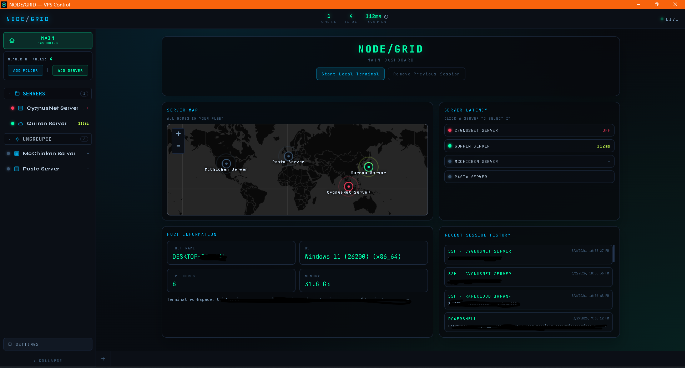
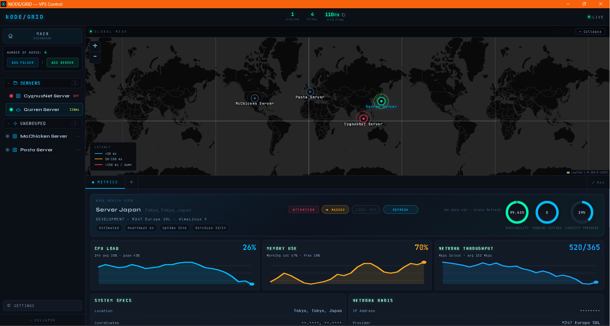

# Terminets

[](./LICENSE)


Terminets is an open-source desktop application for managing and monitoring VPS and server infrastructure from a single interface.

Internally, the UI is branded as **NODE/GRID**. The app combines live infrastructure visibility, terminal access, file operations, and session history into one desktop control surface.

## Stack

Terminets is built with:
- **Tauri 2** for the desktop runtime and native backend
- **Vite 6 + JavaScript** for the frontend
- **Rust** for SSH, telnet, VNC proxying, and local runtime integrations
- **xterm.js** for embedded terminal sessions
- **Leaflet** for node map visualization

## Core capabilities

- Fleet-style dashboard with online, total, and latency status
- Interactive world map of nodes with ping-aware visualization
- SSH session management with embedded terminal tabs
- Local shell support for PowerShell, CMD, Bash, and Zsh
- Metrics and summary panels for selected nodes
- Built-in SFTP browsing and file access workflow
- Recent session history and host information summaries

## Screenshots

Main dashboard view:



Terminal and management view:



## Project structure

- `src/` contains the frontend application, styling, and bundled assets
- `src/app.js` is the main UI entry point
- `src-tauri/` contains the Tauri application and Rust backend
- `src-tauri/src/main.rs` is the backend entry point
- `package.json` defines the frontend and Tauri scripts

## Getting started

### Prerequisites

- Node.js and npm
- Rust toolchain
- Tauri system prerequisites for your platform

### Development

```bash
npm install
npm run dev
```

### Production build

```bash
npm run build
```

## License

This project is licensed under the Apache License 2.0. See [LICENSE](./LICENSE).

Redistributions and forks should also preserve the attribution notice in [NOTICE](./NOTICE).
